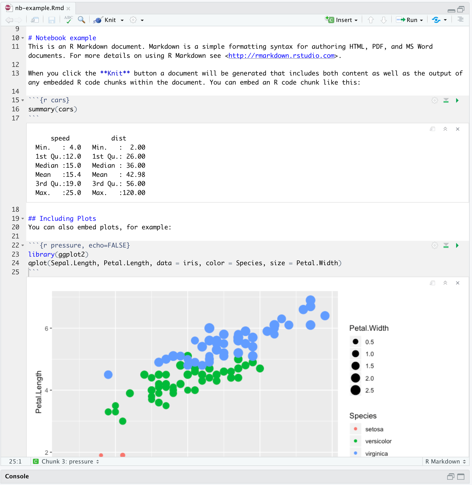
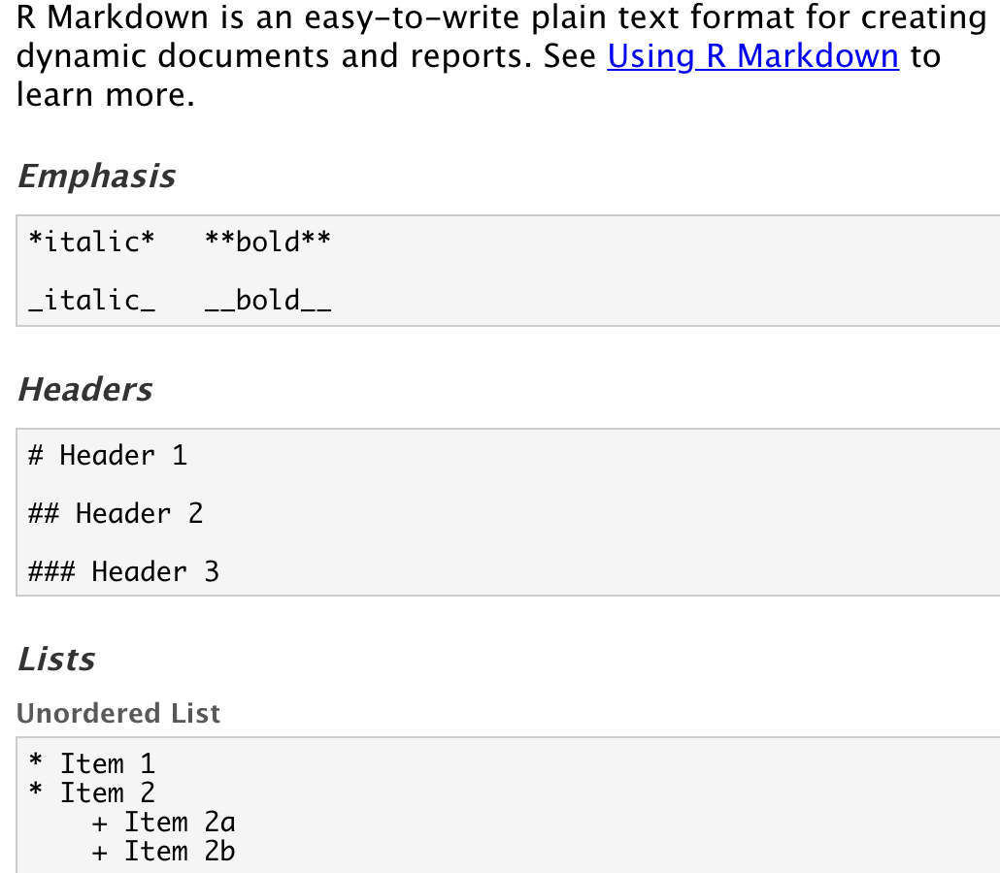
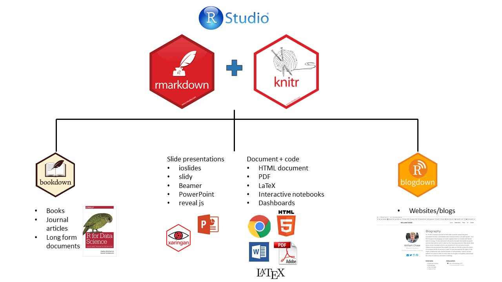
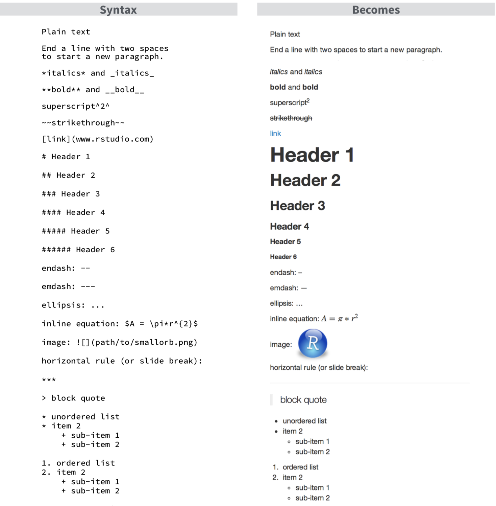

class: title-slide

```{r setup, include=FALSE}
knitr::opts_chunk$set(echo = FALSE, fig.path = "figures/")
library(tidyverse)
library(magick)
library(reticulate)
```

.row[
.col-7[
.title[
# Hello, R Markdown!
]
.subtitle[
## Day 1: Introduction
### Project TIER Faculty Development Workshop, 12-13 March 2019
]
.author[
### Ulrik Lyngs <br> [ulriklyngs.com](https://ulriklyngs.com) <br> [<i class="fab fa-github"></i>](https://github.com/ulyngs) [<i class="fab fa-twitter"></i>](https://twitter.com/ulyngs)[<i class="ai ai-google-scholar"></i>](https://scholar.google.co.uk/citations?user=e8XDAzcAAAAJ&hl=en)
]

.affiliation[
### Department of Computer Science <br> University of Oxford
]

]

.col-5[

.logo[
```{r}
knitr::include_graphics("figures/rmarkdown.png")
```
]

Slides:<br> [ulyngs.github.io/rmarkdown-workshop-2019](https://ulyngs.github.io/rmarkdown-workshop-2019/)

Materials:<br> [github.com/ulyngs/rmarkdown-workshop-2019](https://github.com/ulyngs/rmarkdown-workshop-2019)


]

]

???

- who am I?
- 3rd year DPhil student, [Human Centred Computing Group](https://www.cs.ox.ac.uk/research/HCC/)
- Cognitive psychologist-turned-computer scientist
- fan of open science, think R Markdown's got stuff going for it

---
<iframe width="1300" height="600" src="https://www.youtube.com/embed/s3JldKoA0zw" frameborder="0" allow="accelerometer; autoplay; encrypted-media; gyroscope; picture-in-picture" allowfullscreen></iframe>
---
class: center, middle, inverse

# Why am I here?

---
class: larger-body
# R Markdown nerd

.pull-left[
**Packages for paper and thesis writing with R markdown**
- ACM CHI conference - [proceedings](https://github.com/ulyngs/chi-proc-rmd-template) and [extended abstracts](https://github.com/ulyngs/chi-ea-rmd-template) format
- Example paper on OSF: [Self-Control in Cyberspace: Applying Dual Systems Theory to Self-Control Tools](https://osf.io/zyj4h/) 
- [`oxforddown`](https://github.com/ulyngs/oxforddown) template for Oxford University thesis writing
]

--
.pull-right[
**Blogging (in and about R Markdown)**
- [How to adapt journals' LaTeX templates for use with R Markdown](https://ulyngs.github.io/blog/posts/2018-10-28-how-to-write-acm-articles-with-r-markdown/)
- [How to create custom chunk options](https://ulyngs.github.io/blog/posts/2019-02-01-how-to-create-your-own-chunk-options-in-r-markdown/)
- [Advanced customisation with pandoc filters](https://ulyngs.github.io/blog/posts/2019-02-19-how-to-use-pandoc-filters-for-advanced-customisation-of-your-r-markdown-document/)
]

---
class: inverse, center, middle

# Plan

---
class: middle, very-large-body
.pull-left[
## Day 1: Fundamentals
- Why R Markdown?
- Basic syntax: Markdown & code
- Final pieces: Citations & cross-referencing
]

--
.pull-right[
## Day 2: Applications
- Customising your output
- Workflows, collaboration & teaching
- Putting it all together
]

???
- the different levels we have and how we'll handle this
- for the practicals, team up in pairs

---
class: center, middle, inverse

# Day 1: Fundamentals

---
class: very-large-body
# Wouldn't it be great if...

--
- You could have code, results, and text in the same document?

--
- Your results and plots were automatically generated from your data, so your documents were updated if your data changed?

--
- The file format of your documents was future-proof?

--
- The syntax for this was easy?

---
# Wouldn't it be great if...

.pull-left[
- You could have code, results, and text in the same document?
- Your results and plots were automatically generated from your data, so your documents were updated if your data changed?
- The file format of your documents was future-proof?
- The syntax for this was easy?
]

.pull-right[
```{r, out.width="95%"}

```

*Interactive notebook*

]

---
# Wouldn't it be great if...

.pull-left[
- You could have code, results, and text in the same document?
- Your results and plots were automatically generated from your data, so your documents were updated if your data changed?
- The file format of your documents was future-proof?
- The syntax for this was easy?
]

.pull-right[
```{r, echo=FALSE}
knitr::include_graphics("figures/plain-text.png")
```
*Plain text*
]

--
.on-top-right[]

---
# Wouldn't it be great if...

.pull-left[
- You could have code, results, and text in the same document?
- Your results and plots were automatically generated from your data, so your documents were updated if your data changed?
- The file format of your documents was future-proof?
- The syntax for this was easy?
]

.pull-right[
```{r, echo=FALSE}
knitr::include_graphics("figures/latex.png")
```

]

---
# Wouldn't it be great if...

.pull-left[
- You could have code, results, and text in the same document?
- Your results and plots were automatically generated from your data, so your documents were updated if your data changed?
- The file format of your documents was future-proof?
- The syntax for this was easy?
]

.pull-right[
```{r, echo=FALSE}
#image_read("figures/markdown-ref.png") %>% 
#  image_crop("1030x900+0+95") %>% 
#  image_write("figures/cropped.png", format = "png")

```

*Markdown*
]

---

.row[
.col-6[
<blockquote class="twitter-tweet" data-lang="en-gb"><p lang="en" dir="ltr">Hey, here&#39;s a short story whose moral is this: Consider writing empirical reports in RMarkdown... THREAD /1</p>&mdash; Heather Urry (@HeatherUrry) <a href="https://twitter.com/HeatherUrry/status/1100585163829006341?ref_src=twsrc%5Etfw">27 February 2019</a></blockquote> <script async src="https://platform.twitter.com/widgets.js" charset="utf-8"></script> 
]
]

---

.row[
.col-6[
<blockquote class="twitter-tweet" data-lang="en-gb"><p lang="en" dir="ltr">Hey, here&#39;s a short story whose moral is this: Consider writing empirical reports in RMarkdown... THREAD /1</p>&mdash; Heather Urry (@HeatherUrry) <a href="https://twitter.com/HeatherUrry/status/1100585163829006341?ref_src=twsrc%5Etfw">27 February 2019</a></blockquote> <script async src="https://platform.twitter.com/widgets.js" charset="utf-8"></script> 
]

.col-6[
<blockquote class="twitter-tweet" data-conversation="none" data-lang="en-gb"><p lang="en" dir="ltr">A new PDF compiled in a matter of seconds with all of the results - text stats, tables, figures - updated automatically throughout the manuscript LIKE MAGIC. ITS LIKE GODDAMN FUCKING MAGIC. /9 <a href="https://t.co/x32sN8eaai">pic.twitter.com/x32sN8eaai</a></p>&mdash; Heather Urry (@HeatherUrry) <a href="https://twitter.com/HeatherUrry/status/1100585195349135361?ref_src=twsrc%5Etfw">27 February 2019</a></blockquote> <script async src="https://platform.twitter.com/widgets.js" charset="utf-8"></script> 
]

]

---

.row[
.col-6[
<blockquote class="twitter-tweet" data-lang="en-gb"><p lang="en" dir="ltr">Hey, here&#39;s a short story whose moral is this: Consider writing empirical reports in RMarkdown... THREAD /1</p>&mdash; Heather Urry (@HeatherUrry) <a href="https://twitter.com/HeatherUrry/status/1100585163829006341?ref_src=twsrc%5Etfw">27 February 2019</a></blockquote> <script async src="https://platform.twitter.com/widgets.js" charset="utf-8"></script> 

<blockquote class="twitter-tweet" data-lang="en-gb"><p lang="en" dir="ltr">My point is this: If you think you&#39;ll ever be in the position of having to re-do stats for a manuscript at some point - and, c&#39;mon, you know you will - then invest some time in establishing a reproducible manuscript workflow. 11/</p>&mdash; Heather Urry (@HeatherUrry) <a href="https://twitter.com/HeatherUrry/status/1100585200159985665?ref_src=twsrc%5Etfw">27 February 2019</a></blockquote> <script async src="https://platform.twitter.com/widgets.js" charset="utf-8"></script> 


]

.col-6[
<blockquote class="twitter-tweet" data-conversation="none" data-lang="en-gb"><p lang="en" dir="ltr">A new PDF compiled in a matter of seconds with all of the results - text stats, tables, figures - updated automatically throughout the manuscript LIKE MAGIC. ITS LIKE GODDAMN FUCKING MAGIC. /9 <a href="https://t.co/x32sN8eaai">pic.twitter.com/x32sN8eaai</a></p>&mdash; Heather Urry (@HeatherUrry) <a href="https://twitter.com/HeatherUrry/status/1100585195349135361?ref_src=twsrc%5Etfw">27 February 2019</a></blockquote> <script async src="https://platform.twitter.com/widgets.js" charset="utf-8"></script> 
]

]

???
maybe embed this one too: https://twitter.com/dgkeyes/status/1101554699566641152

---

class: center, middle, inverse

# Anatomy of an <br> R Markdown Document

---
**R Markdown file = plain text file with extension _.Rmd_**

````markdown
---
title: "Diamond sizes"
date: 2016-08-25
output: html_document
---

`r ''````{r setup, include=FALSE}
library(ggplot2)
library(dplyr)

smaller <- diamonds %>% 
  filter(carat <= 2.5)
```

# Shine bright like a diamond
We have data about ``r ''`r nrow(diamonds)` diamonds.
Only ``r ''`r nrow(diamonds) - nrow(smaller)` are larger than 2.5 carats. 
The distribution of the remainder is shown below:

`r ''````{r}
smaller %>% 
  ggplot(aes(carat)) + 
  geom_freqpoly(binwidth = 0.01)
  
```
````

???
This is what an R Markdown file looks like - plain text that you save with the extension .Rmd

It has three parts

---

**YAML header ("YAML Ain't Markup Language")**

````markdown
*---
*title: "Diamond sizes"
*date: 2016-08-25
*output: html_document
*---

`r ''````{r setup, include=FALSE}
library(ggplot2)
library(dplyr)

smaller <- diamonds %>% 
  filter(carat <= 2.5)
```

# Shine bright like a diamond
We have data about ``r ''`r nrow(diamonds)` diamonds.
Only ``r ''`r nrow(diamonds) - nrow(smaller)` are larger than 2.5 carats. 
The distribution of the remainder is shown below:

`r ''````{r}
smaller %>% 
  ggplot(aes(carat)) + 
  geom_freqpoly(binwidth = 0.01)
  
```
````

???
- a header between three dashes
- we have these key-value pairs, like 'title: "Diamond sizes"'
- with these we specify meta-data about the document, such as title, author date, etc. and information about what kind of output format we want

---

**Text**

````markdown
---
title: "Diamond sizes"
date: 2016-08-25
output: html_document
---

`r ''````{r setup, include=FALSE}
library(ggplot2)
library(dplyr)

smaller <- diamonds %>% 
  filter(carat <= 2.5)
```

*# Shine bright like a diamond
*We have data about ``r ''`r nrow(diamonds)` diamonds.
*Only ``r ''`r nrow(diamonds) - nrow(smaller)` are larger than 2.5 carats. 
*The distribution of the remainder is shown below:

`r ''````{r}
smaller %>% 
  ggplot(aes(carat)) + 
  geom_freqpoly(binwidth = 0.01)

```
````

---
**Code**

````markdown
---
title: "Diamond sizes"
date: 2016-08-25
output: html_document
---

*`r ''````{r setup, include=FALSE}
*library(ggplot2)
*library(dplyr)
*
*smaller <- diamonds %>% 
* filter(carat <= 2.5)
*```

# Shine bright like a diamond
We have data about ``r ''`r nrow(diamonds)` diamonds.
Only ``r ''`r nrow(diamonds) - nrow(smaller)` are larger than 2.5 carats. 
The distribution of the remainder is shown below:

*`r ''````{r}
*smaller %>% 
* ggplot(aes(carat)) + 
* geom_freqpoly(binwidth = 0.01)
*
*```
````

---
class: center, middle, inverse

# What Can It Do? <br> Output formats

---
class: center, middle

**Document** your analyses, make a **website**, write your **paper**, <br>
make **slides**... the world is your oyster!

```{r, out.width="90%"}

```


???
let's do a quick demo

credit: https://www.williamrchase.com/slides/intro_r_anthropology_2018#82

---

class: center, middle, inverse


---
class: center, middle

# Basic syntax

---
class: syntax-slide

.pull-left[
  ### This...
  \*italics\* and \*\*bold\*\*  
  
  <span>&#96;</span>inline code&#96;
  
  sub~2~/superscript^2^
  
  \~\~strikethrough\~\~
  
  escaped: \\* \\_ \\\
  
  endash: --, emdash: ---
  
  \> blockquote
  
  \# Header 1
  
  \#\# Header 2
  
  *Line break: End line with 2+ spaces, or backslash:* <br>
  Roses are red <br>
  Violets are blue
  
  Roses are red \ <br>
  Violets are blue
]

.pull-right[
  ### turns into this...
  *italics* and **bold**
  
  `inline code`
  
  sub<sub>2</sub>/superscript<sup>2</sup>
  
  ~~strikethrough~~
  
  escaped: \* \_ \\
  
  endash: &ndash;, emdash: &mdash;
  
  > blockquote
  
  # Header 1
  ## Header 2
  
  Roses are red Violets are blue
  
  Roses are red <br>
  Violets are blue
]

---
class: syntax-slide 
.pull-left[
  ### This...
  
  \- unordered list <br>
  &nbsp; &nbsp; \- sub-item <br>
  &nbsp; &nbsp; \- sub-item 2 <br>
  &nbsp; &nbsp; &nbsp; \- sub-sub-item
  
  1\. ordered list <br>
  2\. item 2 <br>
  &nbsp; &nbsp; \- sub-item 1 <br>
  &nbsp; &nbsp; \- sub-item 2
  

  <br>
  inline-math: &#36;A = \pi*r^{2}&#36;
  
  math-block: <span>&#36;</span>&#36;A = \pi*r^{2}&#36;&#36;
  
  \[text for hyperlink\](https://www.google.com)
  
  A footnote [^1]
  
  [^1]: here is the footnote text.
  
  <span><!-</span>- this is a comment that won't be shown -<span>-></span>
  
]
.pull-right[
  ### turns into this...
  
  - unordered list
    - sub-item
    - sub-item 2
      - sub-sub-item
  
  1. ordered list
  1. item 2 <br>
    i. sub-item 1 <br>
    ii. sub-item 2
  
  inline-math: $A = \pi*r^{2}$
  
  math-block: $$A = \pi*r^{2}$$
  
  [text for hyperlink](https://www.google.com)
  
  A footnote<sup>1</sup>
  
  .footnote[[1] Here is the footnote text.]
  
]

---
class: practice-slide

.center[
# Time for practice!
]

Everybody should already have on their laptops...
- [R](https://cran.rstudio.com) and [RStudio](https://www.rstudio.com/products/rstudio/download/preview/) + the R packages `bookdown` and `tidyverse` (`install.packages("package-name")`)
- a LaTeX installation, for knitting to PDF (`tinytex::install_tinytex()`)

--
.row[

.col-4[
## Beginner
]
.col-4[
## Intermediate
]
.col-4[
## Advanced
]

]

--
.row[

.col-4.beginner[
*Create a new R Markdown file* <br>
(File > New File > R Markdown...)

*Knit to HTML, PDF, Word*

*Tweak the content*
- add your name and today's date to YAML header
- add a paragraph, containing a header, **bold**, and *italics*
- knit to output of your choice
- what creates linebreaks and new paragraphs?
]
  
.col-4.intermediate[
In a new R Markdown file, add a paragraph that contains
- a hyperlink
- a blockquote
- a comment
- some math

Skim through the references available from within RStudio:
- Help > Cheatsheets > R Markdown Cheat Sheet
- Help > Cheatsheet > R Markdown Reference Guide
- Help > Markdown Quick Reference
]

.col-4.advanced[
- When making footnotes, what are the two ways to create the actual footnote text?
- How do you get literal backticks (&#96;) in your output?
- What's the difference between outputting to `rmarkdown::pdf_document` and `bookdown::pdf_document2`?

]

]


---
class: center, middle

# Code

---
class: small-font
# Code chunks


--

**Some common chunk options** (see e.g. [bookdown.org](https://bookdown.org/yihui/rmarkdown/r-code.html))
- `echo`: whether or not to display code in knitted output
- `eval`: whether or to to run the code in the chunk when knitting
- `include`: wheter to include anything from the from a code chunk in the output document
- `fig.cap`: figure caption

---
class: larger-body
# Typical chunks
### Setup chunk
````markdown
`r ''````{r setup, include=FALSE}
# don't show code unless we explicitly set echo = TRUE
knitr::opts_chunk$set(echo = FALSE)

library(tidyverse)
```
````

--
- Normally, an R Markdown document starts with a chunk that's used to set some options and load required libraries.

--
- `knitr::opts_chunk$set` sets default options for all chunks.


---
### Including images

.pull-left[
````markdown
`r ''````{r, fig.cap="R Markdown logo"}

```
````
]

.pull-right[
```{r, out.width="60%", fig.align='center'}
knitr::include_graphics("figures/rmarkdown.png")
```
.caption[
R Markdown logo
]

]

---
### Including plots

.pull-left[
````markdown
`r ''````{r, fig.cap = "A ggplot of car stuff"}
cars %>% 
  ggplot() +
    aes(x = speed, y = dist) +
    geom_point()
```
````

]

.pull-right[
```{r, out.width="90%", fig.align='center'}
cars %>% 
  ggplot() +
    aes(x = speed, y = dist) +
    geom_point()
```

.caption[
A ggplot of car stuff
]

]


---
class: larger-body
### Including tables

.pull-left[
````markdown
`r ''````{r}
cars %>% 
  head() %>% 
  knitr::kable(caption = "A knitr kable table")
```
````
]

.pull-right[
```{r}
# cars is a built-in-to-R data set of cars
# and their stopping distances
cars %>% 
  head(5) %>% 
  knitr::kable(format = "html", caption = "A knitr kable table")
```

]

<br>

--
- Gotcha: when using [`kable`](https://www.rdocumentation.org/packages/knitr/versions/1.21/topics/kable), captions  are set inside the `kable` function
- The `kable` package is often used with the [`kableExtra`](https://cran.r-project.org/web/packages/kableExtra/vignettes/awesome_table_in_html.html) package
- A number of other packages are available for making pretty tables, see [rmarkdown.rstudio.com](https://rmarkdown.rstudio.com/lesson-7.html)

---
class: larger-body
# Inline code

--
Inside your text you can include code with the syntax <span>&#96;</span>r code here&#96;.


--
For example, <span>&#96;</span>r 4 + 4&#96; would output `r 4 + 4` in your text.

--
```{r, echo = TRUE}
print(diamonds, n = 5)

num_diamonds <- nrow(diamonds)

```

--
.pull-left[
There are <span>&#96;</span>r num_diamonds&#96; rows in the `diamonds` dataset.
]

--
.pull-right[
There are `r num_diamonds` rows in the `diamonds` dataset.
]

---
class: larger-body
# Inline code with python

--
[At the moment](https://stackoverflow.com/questions/47818461/is-there-a-way-in-knitr-to-evaluate-inline-code-chunks-of-other-languages), syntax like <span>&#96;</span>python code here&#96; is not valid.


--
However, you can use the [`reticulate`](https://rstudio.github.io/reticulate/articles/r_markdown.html) package to access variables from python chunks.

--
````markdown
`r ''````{python}
my_number = 4 + 8

print(my_number)

```
````

```{python}
my_number = 4 + 8
print(my_number)
```

--
````markdown
`r ''````{r}
library(reticulate)

py$my_number

```
````

```{r}
py$my_number
```

--
Inline you can then refer to this python variable with <span>&#96;</span>r py$my_number&#96; - `my_number` is `r py$my_number`.


---
class: larger-body
.center[
# Time for practice!
]

.row[

.col-4[
## Beginner
]
.col-4[
## Intermediate
]
.col-4[
## Advanced
]

]

--
.row[

.col-4.beginner[
In a new R Markdown file, use code chunks to
1. include an image with `knitr::include_graphics`
2. include a plot (e.g. `plot(pressure)`)
3. include a table (using `kable`)
4. report a calculation inline
]
  
.col-4.intermediate[
1. Try resizing plots with `out.width` and `fig.width` - what's the difference?
2. How do you set `knitr`'s global options to hide code by default?
3. What other options are available to control if a code block is executed and what results are inserted in the finished report? (Hint: see [R for Data Science, 27.4.2](https://r4ds.had.co.nz/r-markdown.html))
]

.col-4.advanced[
1. What's the use of `cache = TRUE`? How does it relate to the `dependson` chunk option?
2. How might you create new chunk options, if the ones provided by `knitr` are not sufficient?
]
]

???
Beginner

Intermed
1. aspect ratio in generated plot vs resizing after the fact (https://sebastiansauer.github.io/figure_sizing_knitr/)

Advanced
2. see my blogpost, https://ulyngs.github.io/blog/posts/2019-02-01-how-to-create-your-own-chunk-options-in-r-markdown/

---
class: center, middle, inverse

# Final pieces

---
class: larger-body
# Citations

--
<ol>
<li> Put references in a plain text file with the extension **.bib**, in **BibTex** format (most reference managers can do this - [Zotero](https://www.zotero.org) works best, I use [Mendeley](https://www.mendeley.com)).<sup>1</sup>
<br>In the highlighed section, 'Shea2014' is the **citation identifier**.
</ol>
```bibtex
*@article{Shea2014,
  author =        {Shea, Nicholas and Boldt, Annika},
  journal =       {Trends in Cognitive Sciences},
  pages =         {186--193},
  title =         {{Supra-personal cognitive control}},
  volume =        {18},
  year =          {2014},
  doi =           {10.1016/j.tics.2014.01.006},
}
```

--
<ol start = 2>
<li>Reference this file in your YAML header
</ol>
```yaml
---
title: "Citation test"
*bibliography: example.bib
output: html_document
---
```

--
[1] The bibliography can be in other formats as well, including EndNote (**.enl**) and RIS (**.ris**), see [rmarkdown.rstudio.com/authoring_bibliographies_and_citations](https://rmarkdown.rstudio.com/authoring_bibliographies_and_citations.html)

---
class: larger-body
# Citations
<ol start = 3>
<li>In your text, citations go inside brackets and separated by semicolons. <br> By default the Chicago author-date format is used in the output:
</ol>

--
.pull-left[
### This...
Blah blah [@Shea2014; @Lottridge2012].
]

.pull-right[
### turns into this...
  
Blah blah (Shea et al. 2014; Lottridge et al. 2012).
]
---
class: larger-body
# Citations
<ol start = 3>
<li>In your text, citations go inside brackets and separated by semicolons. <br> By default the Chicago author-date format is used in the output:
</ol>


.pull-left[
### This...
Blah blah [@Shea2014; @Lottridge2012].

Shea et al. says blah [-@Shea2014].

@Shea2014 says blah.

Blah blah [see @Shea2014, pp. 33-35; also @Wu2016, ch. 1].
]

.pull-right[
### turns into this...
  
Blah blah (Shea et al. 2014; Lottridge et al. 2012).

Shea et al. says blah (2014).

Shea et al. (2014) says blah.

Blah blah (see Shea et al. 2014, 33–35; also Wu 2016, ch. 1).
]


---
class: larger-body
# Citations
<ol start = 3>
<li>In your text, citations go inside brackets and separated by semicolons. <br> By default the Chicago author-date format is used in the output:
</ol>


.pull-left[
### This...
Blah blah [@Shea2014; @Lottridge2012].
  
Shea et al. says blah [-@Shea2014].

@Shea2014 says blah.

Blah blah [see @Shea2014, pp. 33-35; also @Wu2016, ch. 1].
]

.pull-right[
### turns into this...
  
Blah blah (Shea et al. 2014; Lottridge et al. 2012).

Shea et al. says blah (2014).

Shea et al. (2014) says blah.

Blah blah (see Shea et al. 2014, 33–35; also Wu 2016, ch. 1).
]

You can add e.g `csl: my-style.csl` in the YAML header to change to other formats - browse through and download styles at [zotero.org/styles](https://www.zotero.org/styles)

---
class: larger-body
# Citations
For an easy way to insert citations, try the [`citr`](https://github.com/crsh/citr) RStudio add-in.

.row[
  .col-4[
  `install.packages("citr")`
  ]
  
  .col-8[
  .center[
  ```{r, out.width="75%"}
  knitr::include_graphics("https://raw.githubusercontent.com/crsh/citr/master/tools/images/addin_demo.gif")
  ```
  ]
  ]

]

---
class: larger-body
# Cross-referencing
- The `bookdown` package adds capability to do cross-referencing. We can refer to **sections** within our document, to **figures** and **tables**, and even pieces of **text**.

--
- To enable this ability, set output to e.g. `bookdown::html_document2`, `bookdown::pdf_document2`, `bookdown::word_document2`, etc. (see [bookdown.org](https://bookdown.org/yihui/bookdown/output-formats.html))


--
```yaml
---
title: "Cross-referencing test"
output: bookdown::html_document2
---
```

---
class: larger-body
### Section references
- Headers are automatically assigned a reference label, which is the text in lower caps separated by dashes

--
  - For example, the label for `# My header` is `my-header`

--
- The cross-reference syntax is `\@ref(label)` 

--
  - So `# My header` can be referenced with `\@ref(my-section)`
  
--
  - .Rmd: `See section \@ref(my-header)` -> output: 'See section 1'
  
  
---
class: larger-body
### Section references
- You can also use hyperlink syntax and add \# before the label

--
  - .Rmd: `[see this section](#my-header)` -> output: '[see this section](#section-references)'

--
- Create custom labels by adding `{#label}` after a header, e.g. `# My section {#my-label}`.


--
Examples here: [Rmd file](https://github.com/ulyngs/rmarkdown-workshop-2019/blob/master/examples/cross_referencing.Rmd) and [HTML output](examples/cross_referencing.html).

---
class: larger-body
## Figure and table references
- **GOTCHA**: Figures and tables must have captions if you wish to cross-reference them.

.pull-left[
````markdown
`r ''````{r captain, fig.cap="A marvel-lous meme"}
knitr::include_graphics("figures/captain.jpeg")
```
````

```{r captain, fig.align='center', fig.cap="A marvel-lous meme", out.width="65%"}
knitr::include_graphics("figures/captain.jpeg")
```

]

--
.pull-right[
- To refer to figures (plots and images) use the syntax `\@ref(fig:label)`<sup>1</sup>
- So we'd refer to this image with `\@ref(fig:captain)`
- Again, examples here: [Rmd](https://github.com/ulyngs/rmarkdown-workshop-2019/blob/master/examples/cross_referencing.Rmd), [HTML](examples/cross-referencing.html)
]


--
.pull-right[
.footnote[
[1] Recall that the first chunk option after the language is the label (we could also be explicit with `label=captain`).
]

]

---
class: larger-body
## Figure and table references
.pull-left[
````markdown
`r ''````{r cars}
knitr::kable(cars[1:5,],
            caption="Stopping cars")
```
````

```{r cars}
knitr::kable(cars[1:5,],
            caption="Stopping cars")
```

]


--
.pull-right[
- To refer to tables use the syntax `\@ref(tab:label)`
- So we'd refer to this table with `\@ref(tab:cars)`
- ...examples here: [Rmd](https://github.com/ulyngs/rmarkdown-workshop-2019/blob/master/examples/cross_referencing.Rmd), [HTML](examples/cross-referencing.html)
]
---
class: larger-body
.center[
# Time for practice!
]

.row[

.col-4[
## Beginner
]
.col-4[
## Intermediate
]
.col-4[
## Advanced
]

]

--
.row[

.col-4.beginner[
1. Install the `citr` RStudio add-in
2. Open **examples/citation_test.Rmd** and add a new paragraph in which you use `citr` to add two citations - what happens when you knit?
3. Make cross-references to a figure and a table
]
  
.col-4.intermediate[
1. Open **examples/citation_test.Rmd** and change the citation style with `csl: citation_styles/apa.csl`. What happens when you knit?
2. Have a look through [zotero.org/styles](https://www.zotero.org/styles); download another styles and test it.
3. Add a custom label to a header and reference it
]

.col-4.advanced[
1. How do you stop pandoc from automatically inserting cited references by the end of the document?
2. How would you handle a situation where special characters made `fig.cap` mess up? (.black[[hint](https://bookdown.org/yihui/bookdown/markdown-extensions-by-bookdown.html#text-references)])
]
]

---
class: center, middle

# That's all for today

<iframe src="https://giphy.com/embed/8UF0EXzsc0Ckg" width="700" height="300" frameBorder="0" class="giphy-embed" allowFullScreen></iframe>