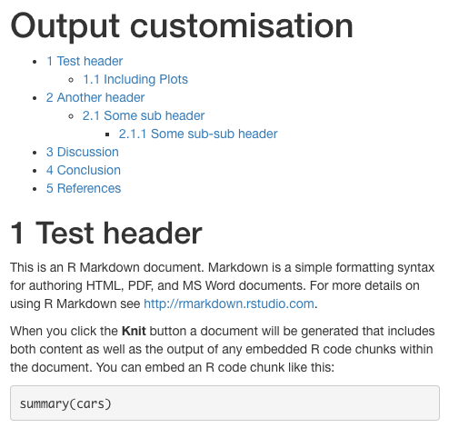
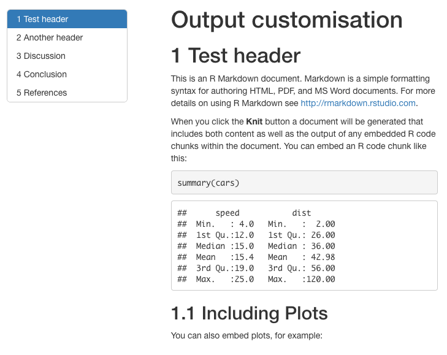
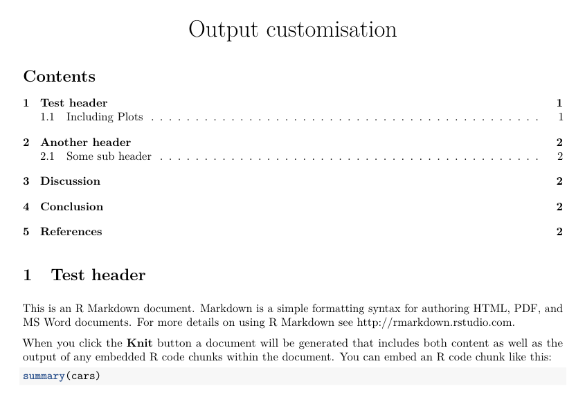
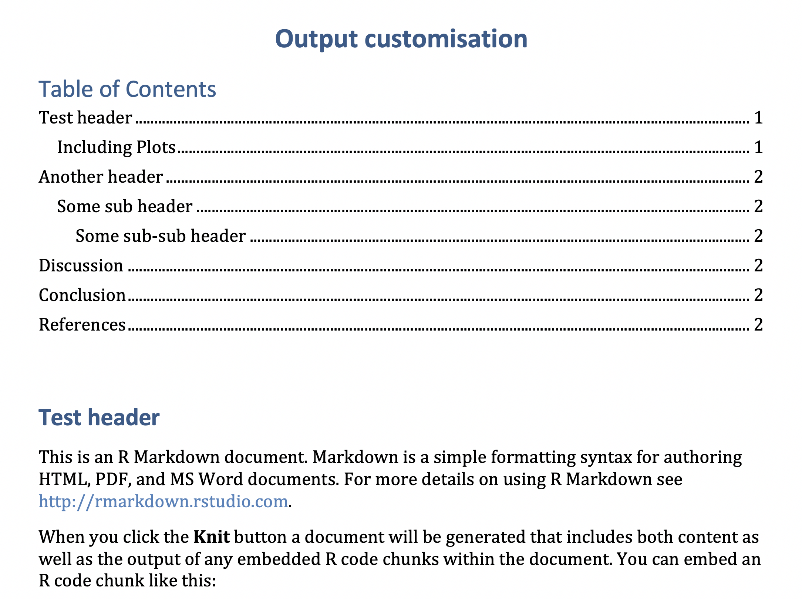
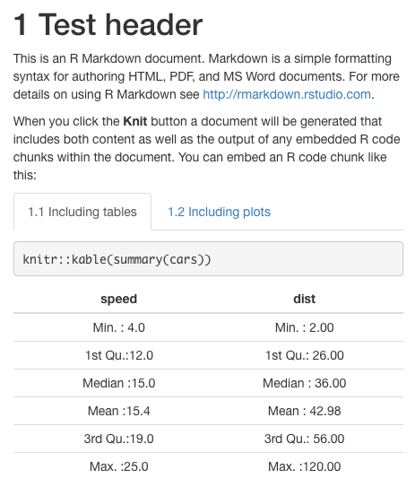
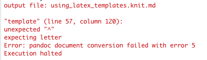
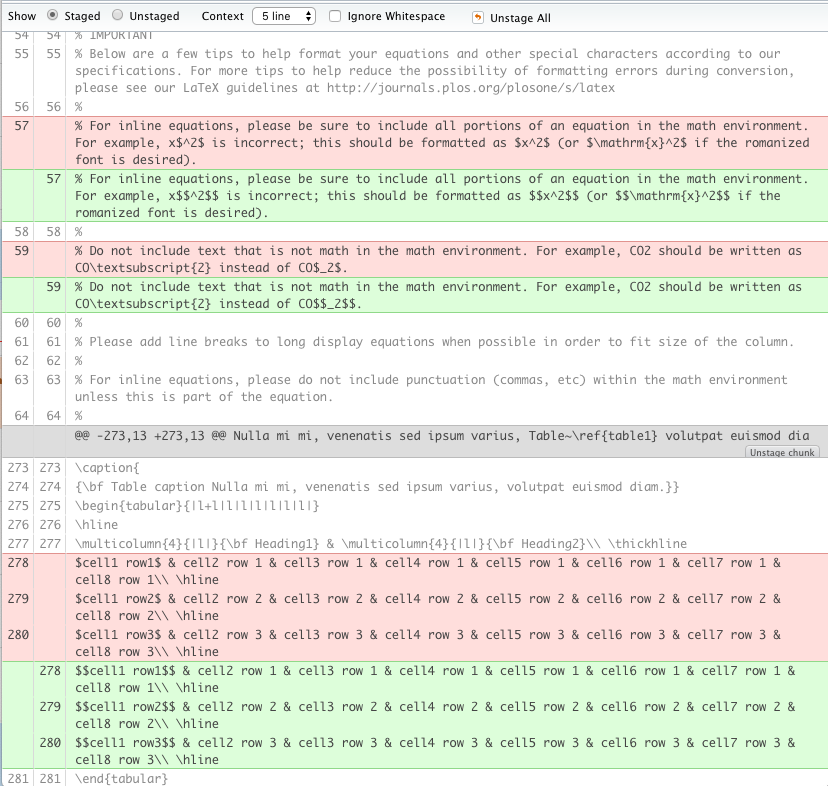
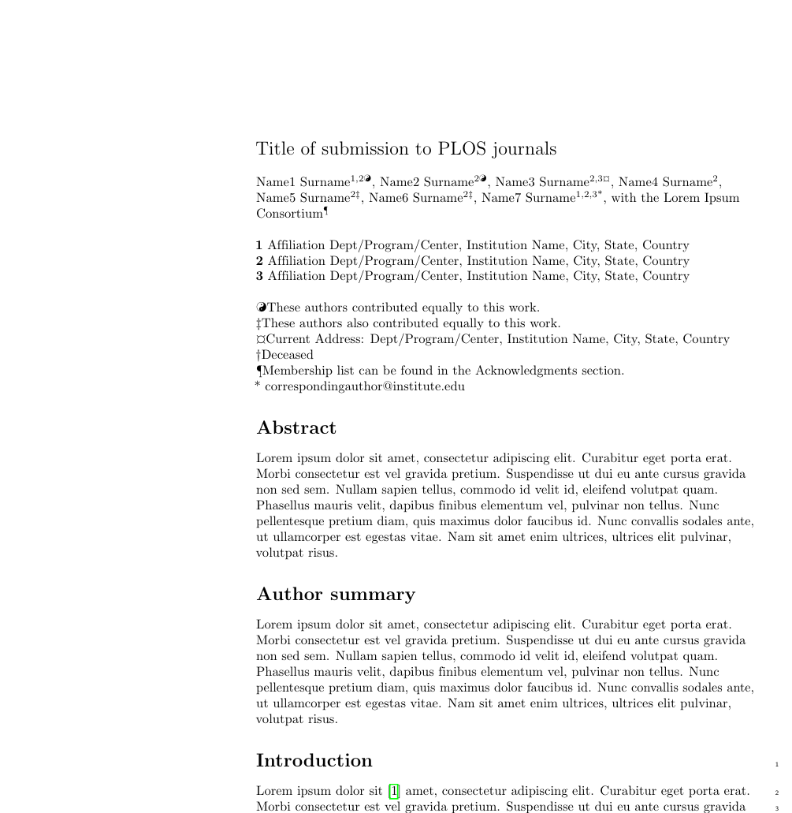
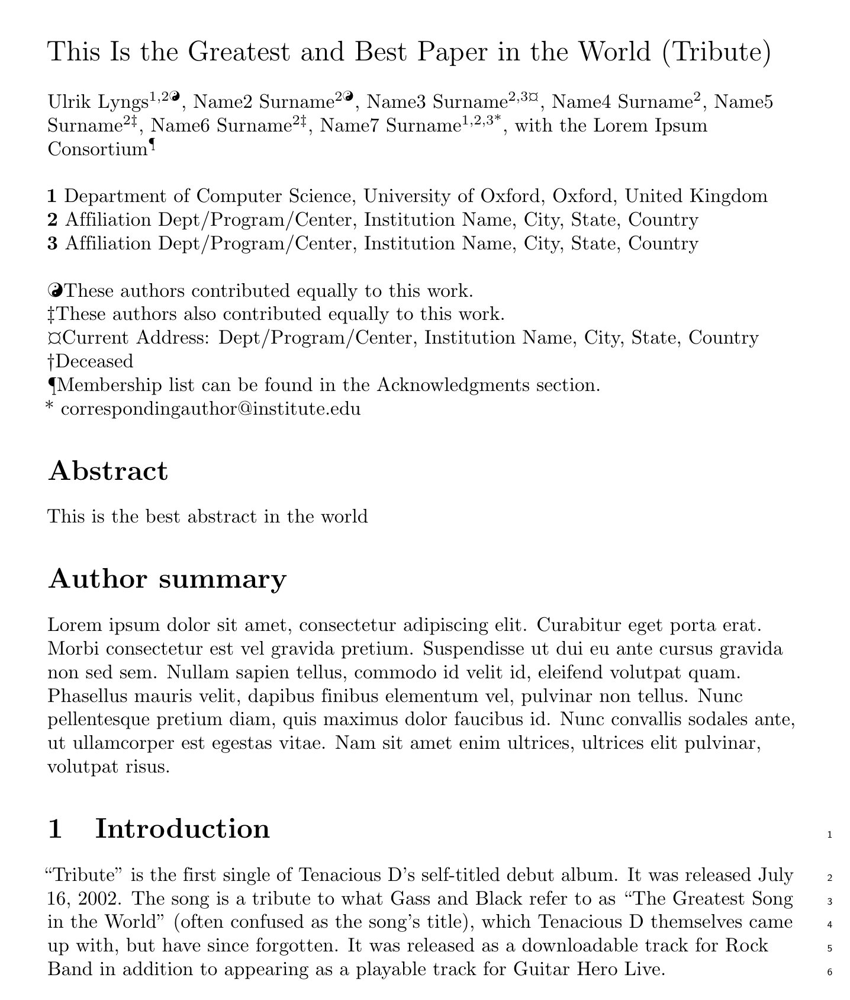

class: title-slide

```{r setup, include=FALSE}
knitr::opts_chunk$set(echo = FALSE)
library(tidyverse)
library(knitr)
```

.row[
.col-7[
.title[
# Hello, R Markdown!
]
.subtitle[
## Day 2: Applications
### Project TIER Faculty Development Workshop, 12-13 March 2019
]
.author[
### Ulrik Lyngs <br> [ulriklyngs.com](https://ulriklyngs.com) <br> [<i class="fab fa-github"></i>](https://github.com/ulyngs) [<i class="fab fa-twitter"></i>](https://twitter.com/ulyngs)[<i class="ai ai-google-scholar"></i>](https://scholar.google.co.uk/citations?user=e8XDAzcAAAAJ&hl=en)
]

.affiliation[
### Department of Computer Science <br> University of Oxford
]

]

.col-5[

.logo[
```{r}
knitr::include_graphics("figures/rmarkdown.png")
```
]

Slides:<br> [ulyngs.github.io/rmarkdown-workshop-2019](https://ulyngs.github.io/rmarkdown-workshop-2019/)

]

]

---
class: middle

.center[
# Plan
]


.pull-left[
## Day 1: Fundamentals
.large[
- Why R Markdown?
- Basic syntax: Markdown & code
- Final pieces: Citations & cross-referencing
]
]

.pull-right[

]


---

class: middle

.center[
# Plan
]


.pull-left.grey[
## Day 1: Fundamentals
.large[
- Why R Markdown?
- Basic syntax: Markdown & code
- Final pieces: Citations & cross-referencing
]
]

.pull-right[
## Day 2: Applications
.large[
- Customising your output
- Workflows, collaboration & teaching
- Putting it all together
]
]

---
class: center, middle, inverse

# Customising your output

???
we'll look at this in two ways
- using YAML options to directly customise the output (you might use this for yourself or you might want to create a template that students should download and fill in)
- adopting a publisher's LaTeX (or Word) template for use with R Markdown

---
## Simple customisation via YAML header

- Many simple customisation options are easily set in the YAML header

--
- The options available depend on the output format (HTML, PDF, etc.), see [bookdown.org](https://bookdown.org/yihui/rmarkdown/documents.html)

--
- Let's have a look at some common options...


---
### Table of contents

.pull-left[
```yaml
---
title: "Output customisation"
output: 
  bookdown::html_document2:
*    toc: true
---
```
]

--
.pull-right[
```{r}

```
]


---
### Table of contents

.pull-left[
```yaml
---
title: "Output customisation"
output: 
  bookdown::html_document2:
    toc: true
    toc_float: true
---
```
]

--
.pull-right[
```{r}

```
]

---
### Table of contents

.pull-left[
```yaml
---
title: "Output customisation"
output: 
*  bookdown::pdf_document2:
    toc: true
---
```
]

--
.pull-right[
```{r}

```
]

---
### Table of contents

.pull-left[
```yaml
---
title: "Output customisation"
output: 
*  bookdown::word_document2:
    toc: true
---
```
]

--
.pull-right[
```{r}

```
]

---
### Putting content in tabs in HTML output
- Add `{.tabset}` after a header to make all sub-headers of the header appear within tabs instead of as standalone sections.


--
.pull-left[

For example:

```markdown
# Test header {.tabset}

## Including tables

(tab content)

## Including plots

(tab content)

```

]

--
.pull-right[
```{r, out.width="80%"}

```

]

---
## Appearance and style
- For HTML, you can use `theme` or a custom **.css** style sheet

--
- `theme` options (see them at [bootswatch.com](https://bootswatch.com/)) : *“cerulean”, “journal”, “flatly”, “darkly”, “readable”, “spacelab”, “united”, “cosmo”, “lumen”, “paper”, “sandstone”, “simplex”, “yeti”*


--
.pull-left[
For example:
```yaml
---
title: "Output customisation"
output: 
  bookdown::html_document2:
    toc: true
    toc_float: true
    theme: darkly
---
```
]


.pull-right[
```{r, out.width="75%"}
include_graphics("figures/html_theme.png")
```

]

---
## Appearance and style
- For fine-grained control, you can supply a template for pandoc to use for the output document:

```yaml
---
title: "Output customisation"
output: 
  bookdown::html_document2:
*    template: my_template.html
  bookdown::pdf_document2:
*    template: my_template.tex
  bookdown::word_document2:
*    reference_docx: my-styles.docx
---
```

--
- For more on HTML templates, see the [pandoc documentation](http://pandoc.org/MANUAL.html#templates) and/or have a look at the [default HTML template](https://github.com/jgm/pandoc-templates/blob/master/default.html5)
- For more on Word templates, watch this short video ([vimeo.com/110804387](https://vimeo.com/110804387)), or read this article ([rmarkdown.rstudio.com/articles_docx.html](https://rmarkdown.rstudio.com/articles_docx.html))

---
## Using LaTeX templates with R Markdown

--
- The [`rticles`](https://github.com/rstudio/rticles) package contains a range of ready-made templates for submissions to a various journals

--
- At the moment, however, many of the templates are not well documented, and it can be difficult to understand what's going on under the hood

--
- It's useful to understand a bit of how it works, for when you find yourself needing to submit something formatted with LaTeX but wish to write in R Markdown (the concept is similar for html templates)

--
- Let's have a look at the [PLOS LaTeX template](http://www.latextemplates.com/template/public-library-of-science-plos)


---
## Using LaTeX templates with R Markdown
.pull-left[
```yaml
---
output: 
  bookdown::pdf_document2:
    template: plos_latex_template.tex
---
```
]


--
.pull-right[
```{r}

```
]

---
class: center, middle, inverse


---
## plos_latex_template.tex
- A dollar sign has special meaning for `pandoc` - when it creates the output, it looks for stuff wrapped in dollar signs and assumes should plug in something from your **.Rmd** file

--
- In `pandoc`, a `$` is escaped with another `$`


--
.pull-left[
If we take a look at line 57 in **plos_latex_template.tex** we see this:
```latex
% For example, x$^2$ is incorrect; 
this should be formatted as $x^2$ 
(or $\mathrm{x}^2$ if the romanized font is desired).
```
]


--
.pull-right[
- We change to this:<br>
<br>

```latex
% For example, x$$^2$$ is incorrect; 
this should be formatted as $$x^2$$ 
(or $$\mathrm{x}^2$$ if the romanized font is desired).
```
]


---
## plos_latex_template.tex
- A dollar sign has special meaning for `pandoc` - when it creates the output, it looks for stuff wrapped in dollar signs and assumes should plug in something from your **.Rmd** file
- In `pandoc`, a `$` is escaped with another `$`

.pull-left[
If we take a look at line 57 in **plos_latex_template.tex** we see this:
```latex
% For example, x$^2$ is incorrect; 
this should be formatted as $x^2$ 
(or $\mathrm{x}^2$ if the romanized font is desired).
```
]

.pull-right[
- Now we get this - seems like we fixed the error, but that there's a few more:

```{r}
include_graphics("figures/template_error2.png")
```
]

---
## plos_latex_template.tex
- Fix this throughout and we finally get what we'd expect:


--
.pull-left[

```yaml
---
output: 
  bookdown::pdf_document2:
    template: plos_latex_template_adapted.tex
---
```

```{r, out.width="90%", fig.align='center'}

```


]


--
.pull-right[

```{r}

```
]

---
## Plug in information from our **.Rmd** file into the template
- Wrap variables from the YAML header in `$`'s to insert them in the template, e.g. `$author$`

--
- The content after the YAML header is referred to with `$body$`


--
.pull-left[
```latex
\textbf\newline{Title of submission to PLOS journals}
\\
Name1 Surname\textsuperscript{1,2\Yinyang},
Name2 Surname\textsuperscript{2\Yinyang},
Name3 Surname\textsuperscript{2,3\textcurrency},
Name4 Surname\textsuperscript{2},
Name5 Surname\textsuperscript{2\ddag},
Name6 Surname\textsuperscript{2\ddag},
Name7 Surname\textsuperscript{1,2,3*},
with the Lorem Ipsum Consortium\textsuperscript{\textpilcrow}
\\
\textbf{1} Affiliation Dept/Program/Center, Institution Name, City, State, Country
\\
\textbf{2} Affiliation Dept/Program/Center, Institution Name, City, State, Country
```
]

.pull-right[
```latex
*\textbf\newline{$title$}
\\
*$author.name$\textsuperscript{1,2\Yinyang},
Name2 Surname\textsuperscript{2\Yinyang},
Name3 Surname\textsuperscript{2,3\textcurrency},
Name4 Surname\textsuperscript{2},
Name5 Surname\textsuperscript{2\ddag},
Name6 Surname\textsuperscript{2\ddag},
Name7 Surname\textsuperscript{1,2,3*},
with the Lorem Ipsum Consortium\textsuperscript{\textpilcrow}
\\
*\textbf{1} $author.affiliation$, $author.city$, $if(author.state)$$author.state$,$endif$ $author.country$
\\
\textbf{2} Affiliation Dept/Program/Center, Institution Name, City, State, Country
```
]


---
## Plug in information from our **.Rmd** file into the template

.pull-left[
```latex
\section*{Abstract}
Lorem ipsum dolor sit amet...
```

```latex
\section*{Introduction}
Lorem ipsum dolor sit...
```

]

.pull-right[
```latex
\section*{Abstract}
$abstract$
```

```latex
$body$
```
]

---
## Plug in information from our **.Rmd** file into the template

.pull-left[
```yaml
---
title: |
  This Is the Greatest and 
  Best Paper in the World (Tribute)
abstract: This is the best abstract in the world
author:
  name: Ulrik Lyngs
  affiliation: |
    Department of Computer Science, 
    University of Oxford
  city: Oxford
  country: United Kingdom
output: 
  bookdown::pdf_document2:
    template: plos_latex_template_adapted.tex
---
```
]

.pull-right[
```{r, out.width="88%"}

```

]

---
class: practice-slide

.center[
# Time for practice!
Examples: Output customisation ([HTML](examples/output_customisation.html), [Rmd](https://github.com/ulyngs/rmarkdown-workshop-2019/blob/master/examples/output_customisation.Rmd)) ; Using LaTeX templates ([HTML](examples/using_latex_templates.html), [Rmd](https://github.com/ulyngs/rmarkdown-workshop-2019/blob/master/examples/using_latex_templates.Rmd))
]

.row[

.col-4[
## Beginner
]
.col-4[
## Intermediate
]
.col-4[
## Advanced
]

]

--
.row[

.col-4.beginner[
1. Toggle table of contents on and off in two different output formats.
2. Find out how to customise what level of headings to include in the table of contents
3. Have a scroll through the range of output formats available in [R Markdown: The Definitive Guide](https://bookdown.org/yihui/rmarkdown/html-document.html).

]
  
.col-4.intermediate[
Have a look at the ['Output formats' section of *R Markdown: The Definitive Guide](https://bookdown.org/yihui/rmarkdown/html-document.html):
1. Try to output to a HTML document where code is hidden but the user can choose to see it.
2. Try to output as Word document using a `reference_docx`. Can you succesfully customise the header and body styles?
]

.col-4.advanced[
1. How would you inspect whether R Markdown is doing what you think it does when you're customisting the output?
2. Find a LaTeX template for submission to your favorite journal and have a quick stab at getting an **.Rmd** file to use it as a template
]
]

---

# Workflows, collaboration, teaching

- structure this in accordance with what you put in the keynote slides

???
- have something about the 

---
class: inverse, middle

.row[

  .col-3[
  ]

.col-6[
<blockquote class="twitter-tweet" data-lang="en-gb"><p lang="en" dir="ltr">Quick demo of the rmdrive 📦workflow - create rmarkdown document in R, add text on google docs, resync to local rmd, knit. <a href="https://twitter.com/hashtag/rstats?src=hash&amp;ref_src=twsrc%5Etfw">#rstats</a> <a href="https://t.co/h09TI8q4w0">pic.twitter.com/h09TI8q4w0</a></p>&mdash; Dr Emily Kothe (@emilyandthelime) <a href="https://twitter.com/emilyandthelime/status/1102015059486621697?ref_src=twsrc%5Etfw">3 March 2019</a></blockquote> <script async src="https://platform.twitter.com/widgets.js" charset="utf-8"></script>
]

  .col-3[
  ]

]


---

# For working with Word and Powerpoint
- The [`officer`](https://davidgohel.github.io/officer/) package - allows you to read **.docx** and **.pptx** files into R and as R objects, manipulate them, and then save out the modified version back to disk


---

.center[
# Final practical!
]

.row[

.col-4[
## Beginner
]
.col-4[
## Intermediate
]
.col-4[
## Advanced
]

]

--
.row[

.col-4.beginner[
1. Make a report from scratch, using the **my-example-document** (this one will have the data computed in there)
- give it your name, today's date, report the main results, cite something, make a cross reference - output to `bookdown::pdf_document2` and `bookdown::html_document2`
]
  
.col-4.intermediate[
1. Make your own template for a teaching situation relevan to your
2. Figure out how the Open Science Framework R interface works, and suggest how it might be used in teaching

]

.col-4.advanced[
1. Make a start on adjusting your favorite journal's LaTeX template for use with R Markdown
2. Make a fictive report (e.g. about the `diamonds` dataset from the `tidyverse` package and use parameters to make reports for each class of diamonds
3. Look into RStudio Connect and suggest how it might be used in your teaching
]
]

---


# Resources / learn more

