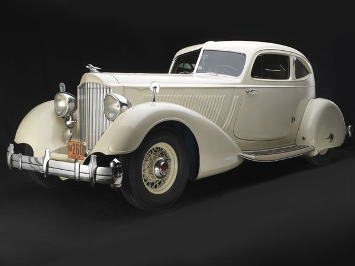

```{r setup, include=FALSE}
knitr::opts_chunk$set(echo = FALSE)
library(tidyverse)
```

<!-- Here's some example calculations using the built-in 'cars' dataset that you can drop in to the report if you're not familiar with R -->

```{r}
### the 'cars' data set give the speed of cars and the distances taken to stop
### (you can get a bit of info by typing ?cars in the R console)

# it looks like this
print(cars)

# how many observations have we got?
num_observations <- nrow(cars)
print(str_c("We have ", num_observations, " observations"))

# what's the average speed (mph)?
ave_speed <- mean(cars$speed, na.rm = TRUE)
print(str_c("Average speed is ", ave_speed, " miles per hour"))

# what's the average stopping length (ft)?
ave_length <- mean(cars$dist, na.rm = TRUE)
print(str_c("Average stopping length is ", ave_length, " feet"))

# here's a plot
ggplot(cars) +
  aes(x = speed, y = dist) +
  geom_point()

# here's the same plot with a fitted regression line
ggplot(cars) +
  aes(x = speed, y = dist) +
  geom_point() +
  stat_smooth(method = "lm", col = "red")

# Finally, here's an image of a nice 1920's car you might want to include


```


# Introduction

# Methods

# Results
## Descriptives

## Findings

# Discussion

# References