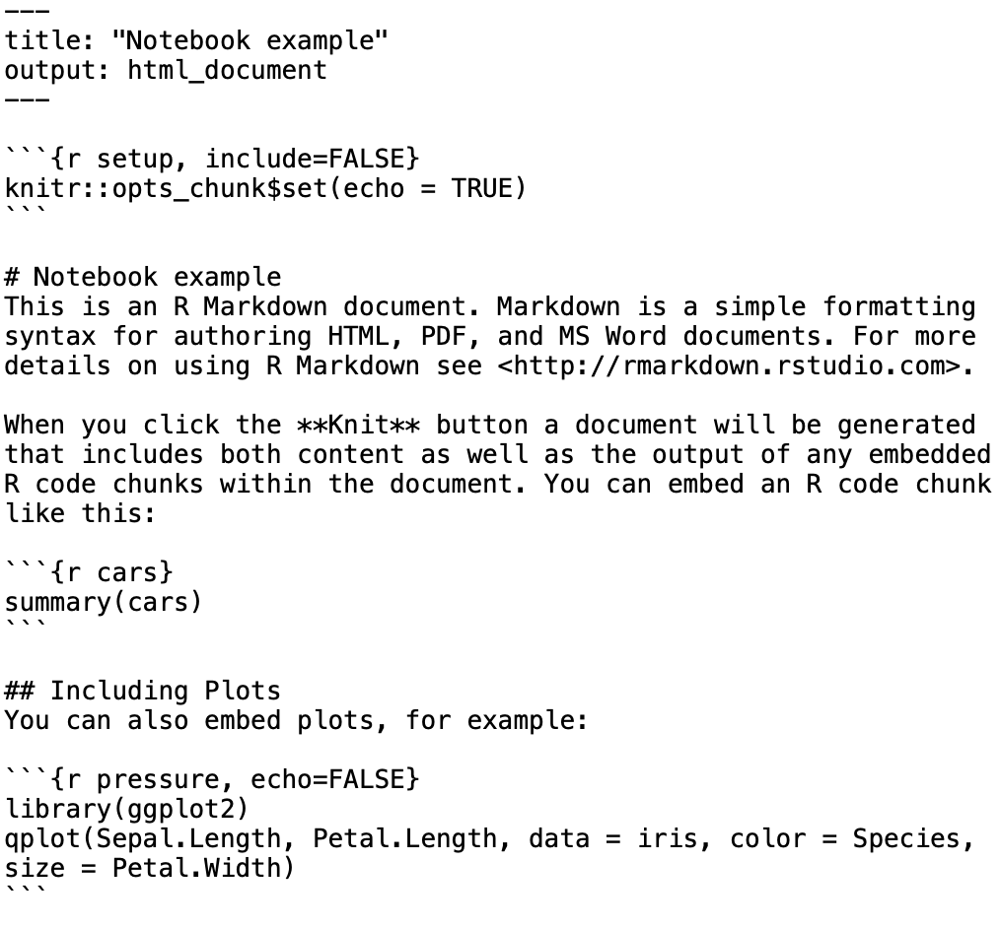
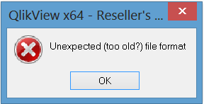
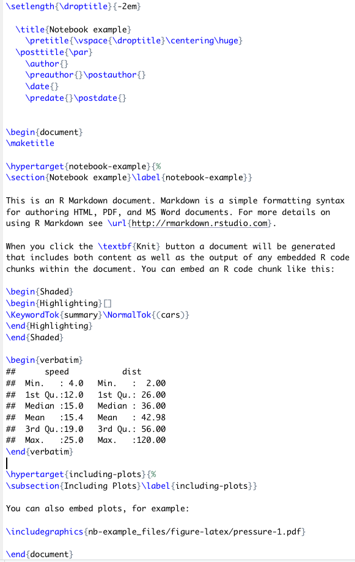
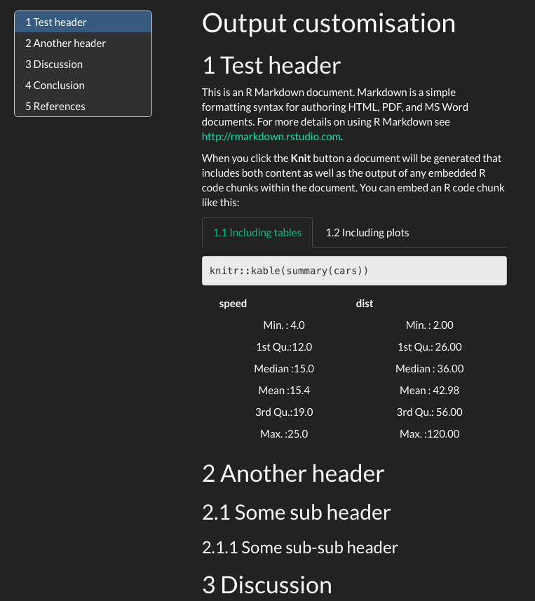
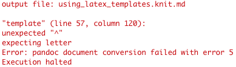
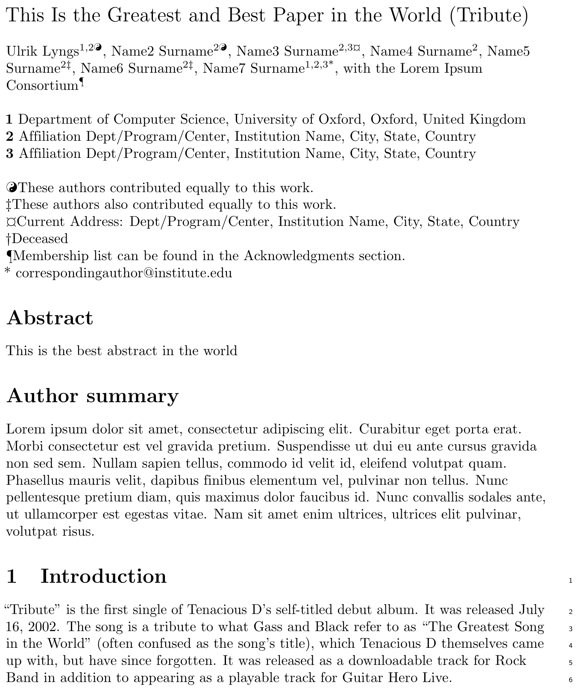

class: title-slide

```{r setup, include=FALSE}
knitr::opts_chunk$set(echo = FALSE, fig.path = "figures/")
library(tidyverse)
library(magick)
library(reticulate)
library(knitr)
use_python("/Users/ulyngs/opt/anaconda3/bin/python")
xfun::pkg_load2(c('base64enc', 'htmltools', 'mime'))
```

.row[
.col-7[
.title[
# Hello, R Markdown!
]
.subtitle[
## How to Write <br> Reproducible Papers
### Oxford R User Group, <br> 4 November 2019
]
.author[
### Ulrik Lyngs <br> [ulriklyngs.com](https://ulriklyngs.com) <br> [<i class="fab fa-github"></i>](https://github.com/ulyngs) [<i class="fab fa-twitter"></i>](https://twitter.com/ulyngs)[<i class="ai ai-google-scholar"></i>](https://scholar.google.co.uk/citations?user=e8XDAzcAAAAJ&hl=en)
]

.affiliation[
### Department of Computer Science <br> University of Oxford
]

]

.col-5[

.logo[
```{r}
knitr::include_graphics("figures/rmarkdown.png")
```
]

Slides adapted from this course:<br> [ulyngs.github.io/rmarkdown-workshop-2019](https://ulyngs.github.io/rmarkdown-workshop-2019/)

Materials from the course:<br> [github.com/ulyngs/rmarkdown-workshop-2019](https://github.com/ulyngs/rmarkdown-workshop-2019)


]

]

???
- I'm Ulrik, and I'll speaking about how to use R Markdown to write your papers, your phd thesis, etc.
- before I say more, it's just been halloween, so I'll start by showing a clip from my favourite scary movie

---
<iframe width="1300" height="600" src="https://www.youtube.com/embed/s3JldKoA0zw" frameborder="0" allow="accelerometer; autoplay; encrypted-media; gyroscope; picture-in-picture" allowfullscreen></iframe>
---
class: center, middle, inverse

# Why am I here?

???

- who am I?
- 3rd year DPhil student, [Human Centred Computing Group](https://www.cs.ox.ac.uk/research/HCC/)
- you are all my procrastination
- Cognitive psychologist-turned-computer scientist
- fan of open science, think R Markdown's got stuff going for it; writing my entire phd thesis in it

---
class: larger-body
# R Markdown nerd

.pull-left[
**Packages for paper, thesis, CV writing with R markdown**
- ACM CHI conference - [proceedings](https://github.com/ulyngs/chi-proc-rmd-template) and [extended abstracts](https://github.com/ulyngs/chi-ea-rmd-template) format
- Example paper on OSF: [Self-Control in Cyberspace: Applying Dual Systems Theory to Self-Control Tools](https://osf.io/zyj4h/) 
- [`oxforddown`](https://github.com/ulyngs/oxforddown) template for Oxford University thesis writing
- [`pagedown cv`](https://github.com/ulyngs/pagedown-cv) template for writing your CV in R Markdown and pull in content automatically from spreadsheet
]

--
.pull-right[
**Blogging (in and about R Markdown)**
- [How to adapt journals' LaTeX templates for use with R Markdown](https://ulyngs.github.io/blog/posts/2018-10-28-how-to-write-acm-articles-with-r-markdown/)
- [How to create custom chunk options](https://ulyngs.github.io/blog/posts/2019-02-01-how-to-create-your-own-chunk-options-in-r-markdown/)
- [Advanced customisation with pandoc filters](https://ulyngs.github.io/blog/posts/2019-02-19-how-to-use-pandoc-filters-for-advanced-customisation-of-your-r-markdown-document/)
]

---
class: inverse, center, middle

# Plan

---
class: middle, very-large-body
.pull-left[
## First half: <br> basics & not-so-basics
- Why R Markdown?
- Basic syntax: Markdown & code
- Citations & cross-referencing
- Using LaTeX templates
]

--
.pull-right[
## Second half: <br> demo
- Adapting a template 
- Thesis writing with `oxforddown`
]

???
- ask: how many know what R Markdown is
- among those who do, how many consider themselves: i) beginners, ii) medium, iii) experts

---
class: center, middle, inverse

# Why R Markdown?

---
class: very-large-body
# Wouldn't it be great if...

--
- You could have code, results, and text in the same document?

--
- Your results and plots were automatically generated from your data, so your documents were updated if your data changed?

--
- The file format of your documents was future-proof?

--
- The syntax for this was easy?

---
# Wouldn't it be great if...

.pull-left[
- You could have code, results, and text in the same document?
- Your results and plots were automatically generated from your data, so your documents were updated if your data changed?
- The file format of your documents was future-proof?
- The syntax for this was easy?
]

.pull-right[
```{r, out.width="95%"}
knitr::include_graphics("figures/notebook-demo.png")
```

*Interactive notebook*

]

---
# Wouldn't it be great if...

.pull-left[
- You could have code, results, and text in the same document?
- Your results and plots were automatically generated from your data, so your documents were updated if your data changed?
- The file format of your documents was future-proof?
- The syntax for this was easy?
]

.pull-right[
```{r, echo=FALSE}

```
*Plain text*
]

--
.on-top-right[]

---
# Wouldn't it be great if...

.pull-left[
- You could have code, results, and text in the same document?
- Your results and plots were automatically generated from your data, so your documents were updated if your data changed?
- The file format of your documents was future-proof?
- The syntax for this was easy?
]

.pull-right[
```{r, echo=FALSE}

```

]

---
# Wouldn't it be great if...

.pull-left[
- You could have code, results, and text in the same document?
- Your results and plots were automatically generated from your data, so your documents were updated if your data changed?
- The file format of your documents was future-proof?
- The syntax for this was easy?
]

.pull-right[
```{r, echo=FALSE}
#image_read("figures/markdown-ref.png") %>% 
#  image_crop("1030x900+0+95") %>% 
#  image_write("figures/cropped.png", format = "png")
knitr::include_graphics("figures/cropped.png")
```

*Markdown*
]

---

.row[
.col-6[
<blockquote class="twitter-tweet" data-lang="en-gb"><p lang="en" dir="ltr">Hey, here&#39;s a short story whose moral is this: Consider writing empirical reports in RMarkdown... THREAD /1</p>&mdash; Heather Urry (@HeatherUrry) <a href="https://twitter.com/HeatherUrry/status/1100585163829006341?ref_src=twsrc%5Etfw">27 February 2019</a></blockquote> <script async src="https://platform.twitter.com/widgets.js" charset="utf-8"></script> 
]
]

???
psychology professor at tufts university

---

.row[
.col-6[
<blockquote class="twitter-tweet" data-lang="en-gb"><p lang="en" dir="ltr">Hey, here&#39;s a short story whose moral is this: Consider writing empirical reports in RMarkdown... THREAD /1</p>&mdash; Heather Urry (@HeatherUrry) <a href="https://twitter.com/HeatherUrry/status/1100585163829006341?ref_src=twsrc%5Etfw">27 February 2019</a></blockquote> <script async src="https://platform.twitter.com/widgets.js" charset="utf-8"></script> 
]

.col-6[
<blockquote class="twitter-tweet" data-conversation="none" data-lang="en-gb"><p lang="en" dir="ltr">A new PDF compiled in a matter of seconds with all of the results - text stats, tables, figures - updated automatically throughout the manuscript LIKE MAGIC. ITS LIKE GODDAMN FUCKING MAGIC. /9 <a href="https://t.co/x32sN8eaai">pic.twitter.com/x32sN8eaai</a></p>&mdash; Heather Urry (@HeatherUrry) <a href="https://twitter.com/HeatherUrry/status/1100585195349135361?ref_src=twsrc%5Etfw">27 February 2019</a></blockquote> <script async src="https://platform.twitter.com/widgets.js" charset="utf-8"></script> 
]

]

---

.row[
.col-6[
<blockquote class="twitter-tweet" data-lang="en-gb"><p lang="en" dir="ltr">Hey, here&#39;s a short story whose moral is this: Consider writing empirical reports in RMarkdown... THREAD /1</p>&mdash; Heather Urry (@HeatherUrry) <a href="https://twitter.com/HeatherUrry/status/1100585163829006341?ref_src=twsrc%5Etfw">27 February 2019</a></blockquote> <script async src="https://platform.twitter.com/widgets.js" charset="utf-8"></script> 

<blockquote class="twitter-tweet" data-lang="en-gb"><p lang="en" dir="ltr">My point is this: If you think you&#39;ll ever be in the position of having to re-do stats for a manuscript at some point - and, c&#39;mon, you know you will - then invest some time in establishing a reproducible manuscript workflow. 11/</p>&mdash; Heather Urry (@HeatherUrry) <a href="https://twitter.com/HeatherUrry/status/1100585200159985665?ref_src=twsrc%5Etfw">27 February 2019</a></blockquote> <script async src="https://platform.twitter.com/widgets.js" charset="utf-8"></script> 


]

.col-6[
<blockquote class="twitter-tweet" data-conversation="none" data-lang="en-gb"><p lang="en" dir="ltr">A new PDF compiled in a matter of seconds with all of the results - text stats, tables, figures - updated automatically throughout the manuscript LIKE MAGIC. ITS LIKE GODDAMN FUCKING MAGIC. /9 <a href="https://t.co/x32sN8eaai">pic.twitter.com/x32sN8eaai</a></p>&mdash; Heather Urry (@HeatherUrry) <a href="https://twitter.com/HeatherUrry/status/1100585195349135361?ref_src=twsrc%5Etfw">27 February 2019</a></blockquote> <script async src="https://platform.twitter.com/widgets.js" charset="utf-8"></script> 
]

]

???
maybe embed this one too: https://twitter.com/dgkeyes/status/1101554699566641152

---

class: center, middle, inverse

# Anatomy of an <br> R Markdown Document

---
**R Markdown file = plain text file with extension _.Rmd_**

````markdown
---
title: "Diamond sizes"
date: 2016-08-25
output: html_document
---

`r ''````{r setup, include=FALSE}
library(ggplot2)
library(dplyr)

smaller <- diamonds %>% 
  filter(carat <= 2.5)
```

# Shine bright like a diamond
We have data about `r knitr::inline_expr("nrow(diamonds)")` diamonds.
Only `r knitr::inline_expr("nrow(diamonds) - nrow(smaller)")` are larger than 2.5 carats. 
The distribution of the remainder is shown below:

`r ''````{r}
smaller %>% 
  ggplot(aes(carat)) + 
  geom_freqpoly(binwidth = 0.01)
  
```
````

???
This is what an R Markdown file looks like - plain text that you save with the extension .Rmd

It has three parts

---

**YAML header ("YAML Ain't Markup Language")**

````markdown
*---
*title: "Diamond sizes"
*date: 2016-08-25
*output: html_document
*---

`r ''````{r setup, include=FALSE}
library(ggplot2)
library(dplyr)

smaller <- diamonds %>% 
  filter(carat <= 2.5)
```

# Shine bright like a diamond
We have data about `r knitr::inline_expr("nrow(diamonds)")` diamonds.
Only `r knitr::inline_expr("nrow(diamonds) - nrow(smaller)")` are larger than 2.5 carats. 
The distribution of the remainder is shown below:

`r ''````{r}
smaller %>% 
  ggplot(aes(carat)) + 
  geom_freqpoly(binwidth = 0.01)
  
```
````

???
- a header between three dashes
- we have these key-value pairs, like 'title: "Diamond sizes"'
- with these we specify meta-data about the document, such as title, author date, etc. and information about what kind of output format we want

---

**Text**

````markdown
---
title: "Diamond sizes"
date: 2016-08-25
output: html_document
---

`r ''````{r setup, include=FALSE}
library(ggplot2)
library(dplyr)

smaller <- diamonds %>% 
  filter(carat <= 2.5)
```

*# Shine bright like a diamond
*We have data about `r knitr::inline_expr("nrow(diamonds)")` diamonds.
*Only `r knitr::inline_expr("nrow(diamonds) - nrow(smaller)")` are larger than 2.5 carats.
*The distribution of the remainder is shown below:

`r ''````{r}
smaller %>% 
  ggplot(aes(carat)) + 
  geom_freqpoly(binwidth = 0.01)

```
````

---
**Code**

````markdown
---
title: "Diamond sizes"
date: 2016-08-25
output: html_document
---

*`r ''````{r setup, include=FALSE}
*library(ggplot2)
*library(dplyr)
*
*smaller <- diamonds %>% 
* filter(carat <= 2.5)
*```

# Shine bright like a diamond
We have data about `r knitr::inline_expr("nrow(diamonds)")` diamonds.
Only `r knitr::inline_expr("nrow(diamonds) - nrow(smaller)")` are larger than 2.5 carats. 
The distribution of the remainder is shown below:

*`r ''````{r}
*smaller %>% 
* ggplot(aes(carat)) + 
* geom_freqpoly(binwidth = 0.01)
*
*```
````

---
class: center, middle, inverse

# What Can It Do? <br> Output formats

---
class: center, middle

**Document** your analyses, make a **website**, write your **paper**, <br>
make **slides**... the world is your oyster!

```{r, out.width="90%"}
knitr::include_graphics("figures/rmarkdown_universe.jpg")
```


???
let's do a quick demo

credit: https://www.williamrchase.com/slides/intro_r_anthropology_2018#82

---

class: center, middle, inverse


---
class: center, middle

# Basic syntax

---
class: syntax-slide

.pull-left[
  ### This...
  \*italics\* and \*\*bold\*\*  
  
  <span>&#96;</span>inline code&#96;
  
  sub~2~/superscript^2^
  
  \~\~strikethrough\~\~
  
  escaped: \\* \\_ \\\
  
  endash: --, emdash: ---
  
  \> blockquote
  
  \# Header 1
  
  \#\# Header 2
  
  *Line break: End line with 2+ spaces, or backslash:* <br>
  Roses are red <br>
  Violets are blue
  
  Roses are red \ <br>
  Violets are blue
]

.pull-right[
  ### turns into this...
  *italics* and **bold**
  
  `inline code`
  
  sub<sub>2</sub>/superscript<sup>2</sup>
  
  ~~strikethrough~~
  
  escaped: \* \_ \\
  
  endash: &ndash;, emdash: &mdash;
  
  > blockquote
  
  # Header 1
  ## Header 2
  
  Roses are red Violets are blue
  
  Roses are red <br>
  Violets are blue
]

---
class: syntax-slide 
.pull-left[
  ### This...
  
  \- unordered list <br>
  &nbsp; &nbsp; \- sub-item <br>
  &nbsp; &nbsp; \- sub-item 2 <br>
  &nbsp; &nbsp; &nbsp; \- sub-sub-item
  
  1\. ordered list <br>
  2\. item 2 <br>
  &nbsp; &nbsp; \- sub-item 1 <br>
  &nbsp; &nbsp; \- sub-item 2
  

  <br>
  inline-math: &#36;A = \pi*r^{2}&#36;
  
  math-block: <span>&#36;</span>&#36;A = \pi*r^{2}&#36;&#36;
  
  \[text for hyperlink\](https://www.google.com)
  
  A footnote [^1]
  
  [^1]: here is the footnote text.
  
  <span><!-</span>- this is a comment that won't be shown -<span>-></span>
  
]
.pull-right[
  ### turns into this...
  
  - unordered list
    - sub-item
    - sub-item 2
      - sub-sub-item
  
  1. ordered list
  1. item 2 <br>
    i. sub-item 1 <br>
    ii. sub-item 2
  
  inline-math: $A = \pi*r^{2}$
  
  math-block: $$A = \pi*r^{2}$$
  
  [text for hyperlink](https://www.google.com)
  
  A footnote<sup>1</sup>
  
  .footnote[[1] Here is the footnote text.]
  
]

---
class: practice-slide

.center[
# Time for practice!
]

.row[

.col-4[
## Beginner
]
.col-4[
## Intermediate
]
.col-4[
## Advanced
]

]

.row[

.col-4.beginner[
*Create a new R Markdown file* <br>
(File > New File > R Markdown...)

*Knit to HTML, PDF, Word*

*Tweak the content*
- add your name and today's date to YAML header
- add a paragraph, containing a header, **bold**, and *italics*
- knit to output of your choice
- what creates linebreaks and new paragraphs?
]
  
.col-4.intermediate[
In a new R Markdown file, add a paragraph that contains
- a hyperlink
- a blockquote
- a comment
- some math

Skim through the references available from within RStudio:
- Help > Cheatsheets > R Markdown Cheat Sheet
- Help > Cheatsheet > R Markdown Reference Guide
- Help > Markdown Quick Reference
]

.col-4.advanced[
- When making footnotes, what are the two ways to create the actual footnote text?
- How do you get literal backticks (&#96;) in your output?
- What's the difference between outputting to `rmarkdown::pdf_document` and `bookdown::pdf_document2`?

]

]

---
class: center, middle, inverse


---
class: center, middle

# Code

---
class: small-font
# Code chunks


--

**Some common chunk options** (see e.g. [bookdown.org](https://bookdown.org/yihui/rmarkdown/r-code.html))
- `echo`: whether or not to display code in knitted output
- `eval`: whether or to to run the code in the chunk when knitting
- `fig.cap`: figure caption

---
class: larger-body
# Typical chunks
### Setup chunk
````markdown
`r ''````{r setup, include=FALSE}
# don't show code unless we explicitly set echo = TRUE
knitr::opts_chunk$set(echo = FALSE)

library(tidyverse)
```
````

--
- Normally, an R Markdown document starts with a chunk that's used to set some options and load required libraries.

--
- `knitr::opts_chunk$set` sets default options for all chunks.


---
### Including images

.pull-left[
````markdown
`r ''````{r, fig.cap="R Markdown logo"}
knitr::include_graphics("figures/markdown.png")
```
````
]

.pull-right[
```{r, out.width="60%", fig.align='center'}
knitr::include_graphics("figures/rmarkdown.png")
```
.caption[
R Markdown logo
]

]

---
### Including plots

.pull-left[
````markdown
`r ''````{r, fig.cap = "A ggplot of car stuff"}
cars %>% 
  ggplot() +
    aes(x = speed, y = dist) +
    geom_point()
```
````

]

.pull-right[
```{r, out.width="90%", fig.align='center', fig.retina = 3}
cars %>% 
  ggplot() +
    aes(x = speed, y = dist) +
    geom_point()
```

.caption[
A ggplot of car stuff
]

]


---
class: larger-body
### Including tables

.pull-left[
````markdown
`r ''````{r}
cars %>% 
  head() %>% 
  knitr::kable(caption = "A knitr kable table")
```
````
]

.pull-right[
```{r}
# cars is a built-in-to-R data set of cars
# and their stopping distances
cars %>% 
  head(5) %>% 
  knitr::kable(format = "html", caption = "A knitr kable table")
```

]

<br>

--
- Gotcha: when using [`kable`](https://www.rdocumentation.org/packages/knitr/versions/1.21/topics/kable), captions  are set inside the `kable` function
- The `kable` package is often used with the [`kableExtra`](https://cran.r-project.org/web/packages/kableExtra/vignettes/awesome_table_in_html.html) package
- A number of other packages are available for making pretty tables, see [rmarkdown.rstudio.com](https://rmarkdown.rstudio.com/lesson-7.html)

---
class: larger-body
# Inline code

--
Inside your text you can include code with the syntax <span>&#96;</span>r code here&#96;.


--
For example, <span>&#96;</span>r 4 + 4&#96; would output `r 4 + 4` in your text.

--
```{r, echo = TRUE}
print(diamonds, n = 5)

num_diamonds <- nrow(diamonds)

```

--
.pull-left[
There are <span>&#96;</span>r num_diamonds&#96; rows in the `diamonds` dataset.
]

--
.pull-right[
There are `r num_diamonds` rows in the `diamonds` dataset.
]

---
class: center, middle, inverse

# Citations & cross-references

---
class: larger-body
# Citations

--
<ol>
<li> Put references in a plain text file with the extension **.bib**, in **BibTex** format (most reference managers can do this - [Zotero](https://www.zotero.org) works best.<sup>1</sup>
<br>In the highlighed section, 'Shea2014' is the **citation identifier**.
</ol>
```bibtex
*@article{Shea2014,
  author =        {Shea, Nicholas and Boldt, Annika},
  journal =       {Trends in Cognitive Sciences},
  pages =         {186--193},
  title =         {{Supra-personal cognitive control}},
  volume =        {18},
  year =          {2014},
  doi =           {10.1016/j.tics.2014.01.006},
}
```

--
<ol start = 2>
<li>Reference this file in your YAML header
</ol>
```yaml
---
title: "Citation test"
*bibliography: references.bib
output: html_document
---
```

---
class: larger-body
# Citations
<ol start = 3>
<li>In your text, citations go inside brackets and separated by semicolons.
</ol>

--
.pull-left[
### This...
Blah blah [@Shea2014; @Lottridge2012].
]

.pull-right[
### turns into this...
  
Blah blah (Shea et al. 2014; Lottridge et al. 2012).
]
---
class: larger-body
# Citations
<ol start = 3>
<li>In your text, citations go inside brackets and separated by semicolons.
</ol>


.pull-left[
### This...
Blah blah [@Shea2014; @Lottridge2012].

Shea et al. says blah [-@Shea2014].

@Shea2014 says blah.

Blah blah [see @Shea2014, pp. 33-35; also @Wu2016, ch. 1].
]

.pull-right[
### turns into this...
  
Blah blah (Shea et al. 2014; Lottridge et al. 2012).

Shea et al. says blah (2014).

Shea et al. (2014) says blah.

Blah blah (see Shea et al. 2014, 33–35; also Wu 2016, ch. 1).
]


---
class: larger-body
# Citations
The best way to handle citations is with [Zotero](https://www.zotero.org) plus the [`citr`](https://github.com/crsh/citr) RStudio add-in:

.row[
  .col-4[
  `install.packages("citr")`
  ]
  
  .col-8[
  .center[
  ```{r, out.width="75%"}
  knitr::include_graphics("https://raw.githubusercontent.com/crsh/citr/master/tools/images/addin_demo.gif")
  ```
  ]
  ]

]

---

class: center, middle, inverse

# Demo


---
class: larger-body
# Cross-referencing
- The `bookdown` package adds cross-referencing. <br> Normally you'll use to refer to **figures**, **tables**, and **sections** within your document.

--
- To enable this, set output to e.g. `bookdown::html_document2`, `bookdown::pdf_document2`, `bookdown::word_document2`, in the YAML header (see [bookdown.org](https://bookdown.org/yihui/bookdown/output-formats.html))


--
```yaml
---
title: "Cross-referencing test"
output: bookdown::html_document2
---
```

--
- The basic cross-reference syntax is `\@ref(label)` 

--
- figures: `\@ref(fig:label)`, tables: `\@ref(tab:label)`

---
class: larger-body
## Figure references

.pull-left[
````markdown
`r ''````{r captain, fig.cap="A marvel-lous meme"}
knitr::include_graphics("figures/captain.jpeg")
```
````

```{r captain, fig.align='center', fig.cap="A marvel-lous meme", out.width="65%"}
knitr::include_graphics("figures/captain.jpeg")
```

]


--
.pull-right[
- Refer to this image with `\@ref(fig:captain)`
]


---
class: larger-body
## Figure and table references
.pull-left[
````markdown
`r ''````{r cars}
knitr::kable(cars[1:5,],
            caption="Stopping cars")
```
````

```{r cars}
knitr::kable(cars[1:5,],
            caption="Stopping cars")
```

]


--
.pull-right[
- Refer to this table with `\@ref(tab:cars)`
]

---
class: larger-body
### Section references
- Assing a label to a header by adding `{#label}` after it, e.g. `# My awesome header {#test-label}`.


--
- Then reference `# My awesome header` with `\@ref(test-label)`


--
- .Rmd: `See section \@ref(test-label)` -> output: 'See section 1'

---
class: center, middle, inverse

# Demo


---

class: center, middle, inverse

# Using templates


---
class: larger-body

## Appearance and style
- In HTML output, you can use `theme` or a custom **.css** style sheet

--
- `theme` options (see them at [bootswatch.com](https://bootswatch.com/)) : *“cerulean”, “journal”, “flatly”, “darkly”, “readable”, “spacelab”, “united”, “cosmo”, “lumen”, “paper”, “sandstone”, “simplex”, “yeti”*


--
.pull-left[
For example:
```yaml
---
title: "Output customisation"
output: 
  bookdown::html_document2:
    toc: true
    toc_float: true
    theme: darkly
---
```
]


.pull-right[
```{r, out.width="75%"}

```

]

---
class: larger-body
## Appearance and style
- For fine-grained control, supply a specific template to use for the output document:

```yaml
---
title: "Output customisation"
output: 
  bookdown::html_document2:
*    template: my_template.html

  bookdown::pdf_document2:
*    template: my_template.tex

  bookdown::word_document2:
*    reference_docx: my-styles.docx #note: 'reference_docx'
---
```

--
- For more on HTML templates, see the [pandoc documentation](http://pandoc.org/MANUAL.html#templates) and/or have a look at the [default HTML template](https://github.com/jgm/pandoc-templates/blob/master/default.html5)
- For more on Word templates, watch this short video ([vimeo.com/110804387](https://vimeo.com/110804387)), or read this article ([rmarkdown.rstudio.com/articles_docx.html](https://rmarkdown.rstudio.com/articles_docx.html))

---
class: larger-body
## Using LaTeX templates with R Markdown

--
- The [`rticles`](https://github.com/rstudio/rticles) package contains a range of ready-made templates for paper submissions

--
- At the moment, many of the templates are not well documented, and it can be difficult to understand what's going on under the hood

--
- It's useful to know a bit about how it works, if you need to submit a paper formatted with LaTeX but want to write in R Markdown

--
- Let's have a look at the [PLOS LaTeX template](http://www.latextemplates.com/template/public-library-of-science-plos)


---
## What's a LaTeX template anyway?

.pull-left[
```{r}
include_graphics("figures/plos_latex.png")
```

]


--
.pull-right[
```{r}
include_graphics("figures/template_compiled.png")
```
]


---
## Using LaTeX templates with R Markdown
.pull-left[
```yaml
---
output: 
  bookdown::pdf_document2:
    template: plos_latex_template.tex
---
```
]


--
.pull-right[
```{r}

```
]

---
class: center, middle, inverse


---
class: larger-body

## plos_latex_template.tex
- Dollar signs have special meaning for `pandoc`


--
- in the template document, `pandoc` will look for stuff wrapped in dollar signs and insert the corresponding content in your **.Rmd** file, before the output document is created


--
- `$` is escaped with another `$`


--
.pull-left[
If we take a look at line 57 in **plos_latex_template.tex** we see this:
```latex
% For example, x$^2$ is incorrect; 
this should be formatted as $x^2$ 
(or $\mathrm{x}^2$ if the romanized font is desired).
```
]


--
.pull-right[
- We change to this:<br>
<br>

```latex
% For example, x$$^2$$ is incorrect; 
this should be formatted as $$x^2$$ 
(or $$\mathrm{x}^2$$ if the romanized font is desired).
```
]

---
class: larger-body

## plos_latex_template.tex
- Fix this throughout and we get normal compilation of the LaTeX template to PDF:


--
.pull-left[

```yaml
---
output: 
  bookdown::pdf_document2:
    template: plos_latex_template_adapted.tex
---
```

```{r, out.width="88%", fig.align='center'}
include_graphics("figures/template_escapes.png")
```


]


--
.pull-right[

```{r, out.width = "95%"}
include_graphics("figures/template_compiled.png")
```
]

---
class: larger-body

## Plug in information from our **.Rmd** file
- Find the places in the LaTeX template where you want to insert content from your R Markdown document

--
- Wrap variables from your YAML header in `$`'s to insert them, e.g. `\textbf\newline{$title$}` 

--
- To insert all the content after your YAML header, type `$body$`


--
.pull-left[
```latex
\textbf\newline{Title of submission to PLOS journals}
\\
Name1 Surname\textsuperscript{1,2\Yinyang},
Name2 Surname\textsuperscript{2\Yinyang},
Name3 Surname\textsuperscript{2,3\textcurrency},
Name4 Surname\textsuperscript{2},
Name5 Surname\textsuperscript{2\ddag},
Name6 Surname\textsuperscript{2\ddag},
Name7 Surname\textsuperscript{1,2,3*},
with the Lorem Ipsum Consortium\textsuperscript{\textpilcrow}
\\
\textbf{1} Affiliation Dept/Program/Center, Institution Name, City, State, Country
\\
\textbf{2} Affiliation Dept/Program/Center, Institution Name, City, State, Country
```
]

.pull-right[
```latex
*\textbf\newline{$title$}
\\
*$author.name$\textsuperscript{1,2\Yinyang},
Name2 Surname\textsuperscript{2\Yinyang},
Name3 Surname\textsuperscript{2,3\textcurrency},
Name4 Surname\textsuperscript{2},
Name5 Surname\textsuperscript{2\ddag},
Name6 Surname\textsuperscript{2\ddag},
Name7 Surname\textsuperscript{1,2,3*},
with the Lorem Ipsum Consortium\textsuperscript{\textpilcrow}
\\
*\textbf{1} $author.affiliation$, $author.city$, $author.country$
\\
\textbf{2} Affiliation Dept/Program/Center, Institution Name, City, State, Country
```
]


---
## Plug in information from our **.Rmd** file

.pull-left[
```latex
\section*{Abstract}
Lorem ipsum dolor sit amet...
```

```latex
\section*{Introduction}
Lorem ipsum dolor sit...
```

]

.pull-right[
```latex
\section*{Abstract}
$abstract$
```

```latex
$body$
```
]

---
## Plug in information from our **.Rmd** file

.pull-left[
```yaml
---
title: This Is the Greatest and Best Paper in the World (Tribute)
abstract: This is the best abstract in the world
author:
  name: Ulrik Lyngs
  affiliation: Department of Computer Science, University of Oxford
  city: Oxford
  country: United Kingdom
output: 
  bookdown::pdf_document2:
    template: plos_latex_template_adapted.tex
---

# Introduction

"Tribute" is the first single of Tenacious D's self-titled debut album. 
It was released July 16, 2002.
The song is a tribute to what Gass and Black refer to as "The Greatest Song in the World" (often confused as the song's title), which Tenacious D themselves came up with, but have since forgotten. 
It was released as a downloadable track for Rock Band in addition to appearing as a playable track for Guitar Hero Live.

```
]

.pull-right[
```{r, out.width="88%"}

```

]


---
class: center, middle

# That's too much information

<iframe src="https://giphy.com/embed/l0NhZ0aUSE8fXag12" width="900" height="450" frameBorder="0" class="giphy-embed" allowFullScreen></iframe>

[ulyngs.github.io/rmarkdown-workshop-2019](https://ulyngs.github.io/rmarkdown-workshop-2019/)

---
# 3 steps in adapting a LaTeX template

1. Make it compile correctly with just the template content (watch out for `$` signs)

2. Pull in the content you want from the YAML header and the body, by surrounding the relevant stuff in dollar signs

3. Enable code inclusion, by adding this at the top for **.tex** template

```latex
$if(highlighting-macros)$
$highlighting-macros$
$endif$
```
